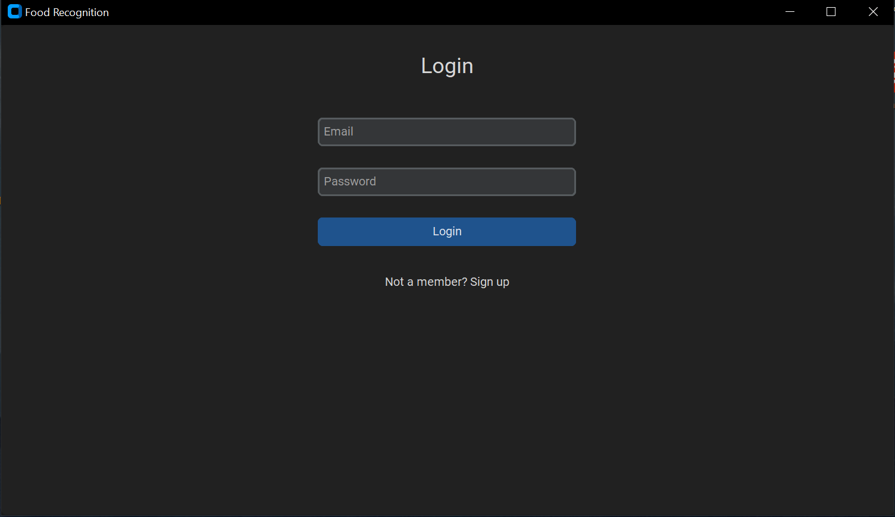
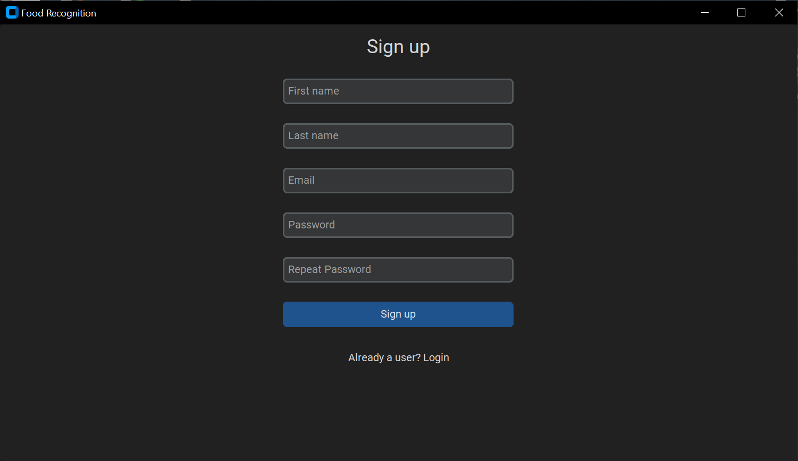
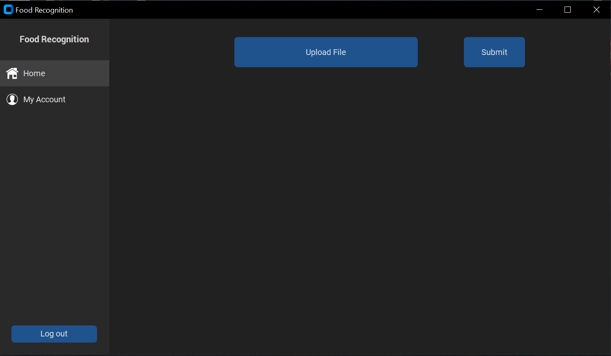
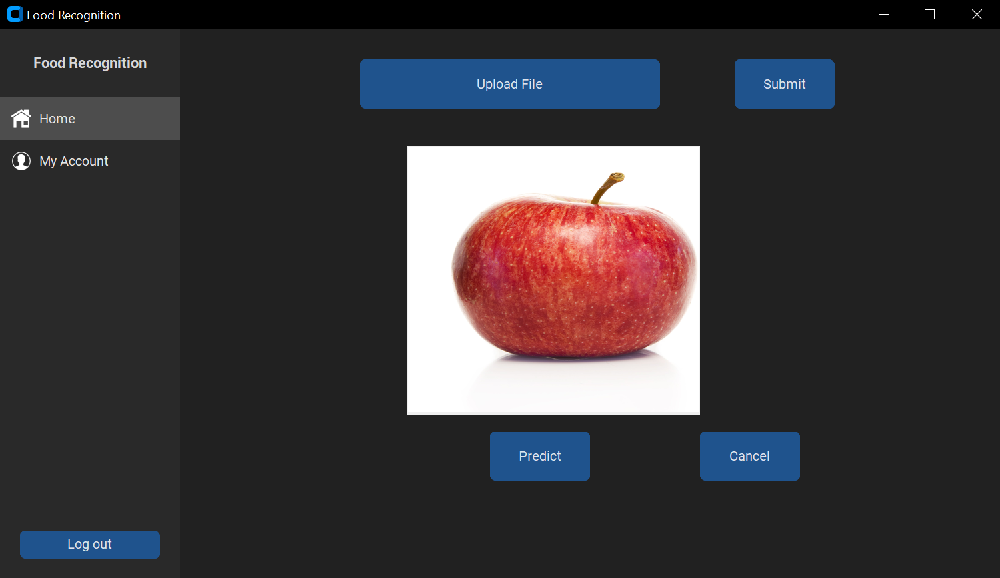
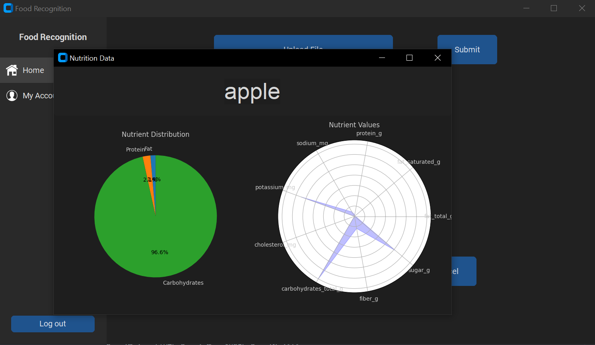
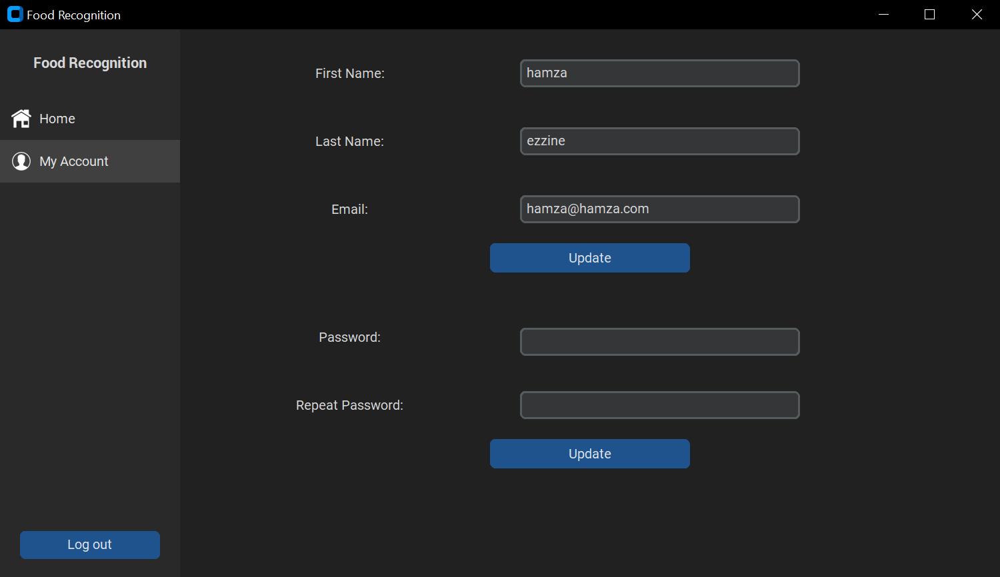

# Food Recognition GUI

<p align="center">
  <h3 align="center">Food Recognition GUI</h3>

  <p align="center">
    Food Recognition GUI using Python 
  </p>
</p>

    


### Built With

* [Python](https://www.python.org/)
* [Jupyter Notebook](https://jupyter.org/)
* [Google Colab](https://colab.research.google.com/)

### Dataset

Fruits and Vegetables Image Recognition Dataset Source: [Fruits and Vegetables Image Recognition Dataset](https://www.kaggle.com/datasets/kritikseth/fruit-and-vegetable-image-recognition)
  
  1. Context :  
  the dataset contains images of the following food items:

  * fruits:  banana, apple, pear, grapes, orange, kiwi, watermelon, pomegranate, pineapple, mango.  
  * vegetables:  cucumber, carrot, capsicum, onion, potato, lemon, tomato, raddish, beetroot, cabbage, lettuce, spinach, soy bean, cauliflower, bell pepper, chilli pepper, turnip, corn, sweetcorn, sweet potato, paprika, jalepeño, ginger, garlic, peas, eggplant.


  2. Content :   
  This dataset contains three folders:  
  * train (100 images each)
  * test (10 images each)
  * validation (10 images each)


### Nutrition API 
Nutrition API Source: [Calorie Ninjas API](https://calorieninjas.com/)

  * Nutrition and recipe data for 100.000+ foods and beverages
  * Free Plan gives 10.000 API calls/month
  * Add your api in **chartstest.py**

### Installation

1. Clone the repo
```bash
git clone https://github.com/hamzaezzine/Food-Recognition-GUI.git
```

2. Install the required dependencies:
```bash
pip install -r requirements.txt
```

### Usage

Run the main python file
```bash
python main.py
```

### Screenshots

Login 


Sign up 


Home 


Home 


Result 


Profile 



